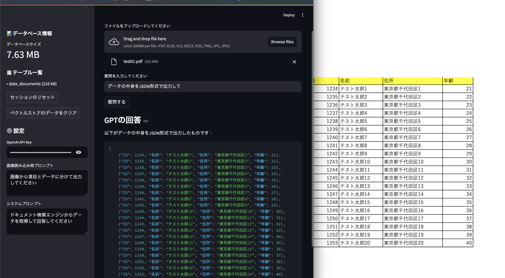

# Multi-Modal Sample Chat Application



PDF、Word、Excel、画像ファイルをアップロードして、テキスト検索と画像認識を組み合わせた対話型アプリケーションです。

## 機能

- 複数フォーマット対応のファイルアップロード
  - PDFファイル
  - Wordファイル（.docx, .doc）
  - Excelファイル（.xlsx, .xls）
  - 画像ファイル（.png, .jpg, .jpeg）
- ファイルからのテキスト抽出
  - PDF: テキストと画像の抽出
  - Word: テキスト、テーブル、ヘッダー、フッター、画像内テキストの抽出
  - Excel: テーブルデータの抽出
  - 画像: OCRによるテキスト抽出
- PostgreSQL + pgvectorを使用した効率的なベクトル検索
- GPT-4を活用した対話型質問応答
- データベース管理機能
  - データベースサイズの表示
  - テーブル情報の表示
  - ベクトルストアのクリア機能
- Streamlitベースの使いやすいUI
  - カスタマイズ可能なプロンプト設定
  - セッション管理機能

## 技術スタック

- Python 3.11
- Streamlit: Web UI
- LlamaIndex: ベクトル検索とエージェント
- OpenAI GPT-4: 対話エンジン
- PostgreSQL + pgvector: ベクトルデータベース
- Docker: コンテナ化

## 必要条件

- Python 3.11以上
- Docker
- Docker Compose
- OpenAI API Key

## セットアップ

1. リポジトリをクローン:
```bash
git clone [repository-url]
cd multi-modal-app
```

2. 環境変数の設定:
`.env`ファイルを作成し、以下の環境変数を設定:
```
OPENAI_API_KEY=your_api_key
PG_HOST=localhost
PG_PORT=5432
PG_DATABASE=ragdb
PG_USER=raguser
PG_PASSWORD=ragpass
CUSTOM_PROMPT=画像から項目とデータに分けて出力してください
SYSTEM_PROMPT=ドキュメント検索エンジンからデータを取得して回答してください
```

3. Docker Composeで起動:
```bash
docker-compose up --build
```

## 使用方法

1. アプリケーションにアクセス:
   - ブラウザで `http://localhost:8501` にアクセス

2. ファイルのアップロード:
   - サポートされている形式（PDF、Word、Excel、画像）のファイルを選択
   - アップロード後、自動的にテキスト抽出とインデックス登録が実行されます

3. 質問:
   - テキストボックスに質問を入力
   - 「質問する」ボタンをクリック

4. 設定（サイドバー）
   - OpenAI API Key: APIキーの設定
   - Model選択（gpt-4.1-mini, gpt-4o-miniのみ）
   - 画像読み込み時プロンプト: 画像処理時の指示を設定
   - システムプロンプト: 回答の出力形式を指定
   - データベース情報: 現在のデータベースサイズとテーブル情報を表示
   - セッションリセット: 現在のセッションをクリア
   - ベクトルストアクリア: 保存されたデータを削除

## プロジェクト構造

```
multi-modal-sample/
├── app/                    # アプリケーションのメインコード
│   ├── __init__.py         # Pythonパッケージ定義
│   ├── config.py           # 設定ファイル（APIキー、DB設定など）
│   ├── db.py              # データベース操作
│   ├── Dockerfile         # アプリケーション用Dockerfile
│   ├── main.py            # アプリケーションのエントリーポイント
│   ├── pyproject.toml     # Pythonプロジェクト設定
│   ├── ui.py              # Streamlit UIの実装
│   └── utils.py           # ユーティリティ関数（ファイル処理、画像処理など）
├── docker-compose.yml     # Docker Compose設定
├── .gitignore            # Git除外設定
└── README.md             # プロジェクトドキュメント
```

### 主要コンポーネント

- `app/config.py`: アプリケーションの設定管理（OpenAI API、データベース接続、エージェント設定）
- `app/db.py`: PostgreSQLデータベース操作（サイズ取得、テーブル情報、クリア機能）
- `app/ui.py`: Streamlitベースのユーザーインターフェース実装
- `app/utils.py`: 各種ファイル形式の処理、テキスト抽出、画像処理
- `app/main.py`: アプリケーションのメインエントリーポイント
- `docker-compose.yml`: PostgreSQLとpgvectorを含む開発環境の設定

